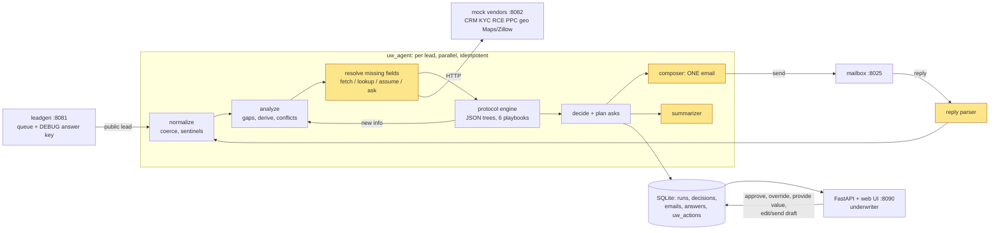

# Stand UW Agentic Assistant (proof of concept)

An assistant for the start of an underwriter's day. It takes a queue of messy property leads, checks each one against the encoded UW playbook, resolves what it can on its own, and drives every lead to one of two clean states: **ready to quote**, or **one consolidated follow-up email** to the producer. The underwriter stays in control: every proposed decision, assumption, draft and escalation is visible and overridable.

- **Playbook as data.** Five FigJam diagrams (six protocols: pools, general plumbing, water heaters, roof class, siding, trusts and LLCs) are encoded as JSON decision trees. A deterministic engine walks them. The model never decides a protocol outcome.
- **Models at the edges only.** Claude reads evidence text, words the follow-up questions, parses free-text replies and writes the underwriter summary. Code validates everything it returns, and every edge has a deterministic fallback.
- **Evals first-class.** 83 graded leads (40 seeded, 43 hand-built fixed cases), metrics per slice, every run stamped with the code version and the run settings.

> **Honest status.** All 109 tests pass and the full loop runs end to end. The Claude-backed edges have only been exercised through an offline rule-based stand-in and scripted fakes: **no run with a real API key has happened yet** (`make smoke-llm` and `make eval` are the first things to do with a key). The web UI is tested through its API and render checks but **has not been looked at in a browser by me**. Both are called out again under [Limits](#limits-and-what-is-not-verified).

---

## 1. Run it

**Prerequisites:** Docker, [uv](https://docs.astral.sh/uv/) (Python 3.11+ is fetched by uv), `make`.

```bash
make setup            # uv sync + enable the version-bump pre-commit hook
make up               # leadgen :8081 (DEBUG=true answer key), mailbox :8025, mock vendors :8082
make ui-offline       # underwriter UI on http://localhost:8090, no API key needed
```

Open http://localhost:8090, click **Run morning queue**. The mock inbox is at http://localhost:8025.

**With Claude** (the intended mode): `cp .env.example .env`, put your key in `ANTHROPIC_API_KEY` (create one at https://console.anthropic.com/settings/keys; the file is gitignored, nothing is ever committed), then `make smoke-llm` (live check of the three model edges) and `make ui` instead of `make ui-offline`. Default model is `claude-sonnet-5-5`, overridable per task (see `.env.example`). If you would rather not create a key, ask the author for a temporary one.

| Command | What it does |
|---|---|
| `make ui` / `make ui-offline` | underwriter UI (Claude / rule-based stand-in) |
| `make run` / `make demo-offline` | the whole queue in the terminal: process, simulate producer replies, re-process |
| `make eval` / `make eval-offline` | all eval sets; `eval-live` runs the seeded sets against the docker stack |
| `make test` | 109 tests, no network and no model needed |
| `make down` | stop the docker services |

**Suggested 3-minute demo path**
1. *Run morning queue* (seed 42). Leads sort into **Ready to quote**, **Needs your decision**, **Awaiting reply**. Each card says what the agent proposes and why.
2. Open an *awaiting reply* lead: the "What we're waiting on" block lists each question and which playbook check it unblocks. The one email it sent is visible, and in the mock inbox.
3. Click **Simulate producer reply** on one lead (demo only: the "producer" answers from the generator's ground truth). The lead re-evaluates and moves to ready or needs-you.
4. Open a *needs your decision* lead: conflicts and escalations, with the evidence. Try **override** (a note is required) or **provide a value**.
5. Untick *auto-send follow-ups* and re-run: emails are drafted for you to review, edit and send instead.
6. **Approve N quick wins** (button above the queue) approves all clean, no-condition quotes at once.

---

## 2. The five product decisions

**1. Human in the loop.** The agent acts alone on routine, reversible, low-risk steps: fetching vendor data, applying the playbook's own defaults, asking the producer for missing facts, and re-evaluating when answers arrive. It stops and hands the lead to the underwriter when the playbook says so (decline, escalate), when the data contradicts itself (conflict rules such as "11 months unoccupied but primary residence"), when a needed system value cannot be fetched, or when something is ambiguous. It never silently resolves doubt: inconclusive evidence is *asked*, not assumed (D24). A switch moves follow-up emails from auto-send to "draft for review". Every underwriter action (approve, override with a required note, provide a value, edit and send a draft, re-run, note) is stored as a structured record, the raw material for the next layer of rules.

**2. Queue orchestration.** Leads run in parallel through one idempotent `process_lead()`; a reply simply re-triggers it from current state, so nothing is double-sent (emails are keyed by a hash of the ask set). The UI orders by value of the underwriter's attention: quick wins first, then ready-with-conditions, declines, genuine decisions, system problems, and last the leads waiting on someone else. A run always starts from a clean slate (mailbox cleared, queue regenerated).

**3. Outbound comms.** One email per lead, merged across *every* blocking protocol (D13). The engine explores all live paths, so a question that matters only on one branch ("is the pool fenced?") goes in the same email as a conditional item ("if you have a pool..."). Only fields the producer can answer are asked, bind-only fields are never chased, and a decline suppresses asks. The model words the questions; code assembles the body, validates that exactly the planned asks appear, retries once, then falls back to a template. Replies are parsed numbered-line first, with the model only for free text.

**4. Visualization.** Three groups (Ready to quote / Needs your decision / Awaiting reply). A card shows the proposed action, a plain-language summary, what passes versus what is outstanding, each question with what it unblocks, assumptions flagged with their evidence, and the email as sent or drafted. Detail shows the full playbook path per check. Nothing needs babysitting: waiting leads are quiet, and the first screen is the work.

**5. Integrations.** CRM, KYC, replacement-cost, protection-class and geo/fire-risk vendors and Maps/Zillow imagery search are **all mocks** (a read-only service over vendor-shaped tables, never a real system). The agent's tool clients are thin and return `found | not_found | unavailable`. Real integrations are on the hit list, with a candid note on why the demo's query construction would not survive contact with them (D25).

---

## 3. Architecture



Yellow nodes have a model call (the interpreter inside *resolve*, composer, summarizer, reply parser). Everything else is plain code.

**Control flow per lead:** `normalize -> [analyze -> resolve -> evaluate protocols]* -> decide -> compose -> persist`. The bracketed loop repeats until nothing new is learned (a fetched value can unblock a derived one, which can unblock a protocol). Ground truth is never in this path: only the reply simulator, the CLI/server demo wiring and the evals may read it, and a test scans every other module for truth imports.

**Stack:** Python 3.11+, hand-rolled orchestration, SQLite, FastAPI plus a single static page, the plain Anthropic SDK, `uv`, pytest.

### Key trade-offs

| Choice | Alternative weighed | Why |
|---|---|---|
| **Deterministic engine walks the playbook; the LLM never decides an outcome** (D1, D6, D11) | LLM traverses the diagram | Underwriting rules must be auditable, testable and eval-able with exact answers. Trees are versioned JSON, one file per diagram, with every ambiguous reading logged in `JUDGEMENT_CALLS.md`. |
| **Hand-rolled pipeline** (D4) | LangGraph, Temporal | The flow is a short fixed pipeline, not an open-ended agent loop. A framework would add concepts to explain without adding capability. Temporal is the right answer for multi-day waits in production (hit list). |
| **Value resolution is a separate, reviewable map** (`field_resolution.json`, D6/D12) | tool choice inside each protocol, or by the model | Fetch / lookup / assume / derive / ask / defer are properties of a *field*, not of a decision node; an underwriter can review one file. **A demo simplification, not a production claim** (D25): real calls will need dynamically constructed queries and source selection. |
| **LLM only at four edges, with structured outputs, code validation and fallbacks** (D20) | one agent with tools | Smaller blast radius, cheap and deterministic tests (the whole loop runs without a key), and the failure mode of a bad model response is "use the template", not "wrong quote". |
| **One consolidated email via conditional asks** (D13) | ask round by round | The brief says one crisp message beats five. Cost: some questions turn out N/A (about 76% of conditional asks in the evals) and hard leads can produce long emails. A cap or priority order is an open product call. |
| **Playbook supersedes the registry's generic `requiredWhen`** (D14) | follow the registry | The diagrams are the playbook the brief says to encode; registry rules are used where the playbook is silent. |
| **SQLite + FastAPI + one HTML page** (D22) | a React app, Postgres | Cheapest thing a reviewer can run and read; the data model is the same one a real UI would use. |
| **Replies simulated from ground truth** | scripted canned replies | A producer's answer is a function of the actual property, so replies stay consistent with the answer key. Partial and no-reply modes exist for the imperfect cases. |

Design records: [`DECISIONS.md`](DECISIONS.md) (D1 to D25, each with the reasoning), [`sim-harness/protocols/JUDGEMENT_CALLS.md`](sim-harness/protocols/JUDGEMENT_CALLS.md) (every ambiguous reading in the diagrams and how it was resolved, for the underwriter to overrule), [`BACKLOG.md`](BACKLOG.md).

---

## 4. Eval loop

`make eval` runs every set through the **real orchestrator** and grades each lead against ground truth.

- **Expected result** = the same protocol engine run on the lead's clean truth (`clean_fields`). That holds protocol logic constant, so a score isolates resolution, asking, escalation and email behaviour. Frozen hand-written expectations on fixed cases are cross-checked against it (a mismatch is reported as *stale*).
- **Sets (D17).** *Seeded:* `s42-mixed`, `s7-hard`, `s101-hard`, `s13-medium` (40 leads), with their composition recorded so generator drift is flagged. *Fixed:* 43 hand-built cases, one per protocol leaf and numeric boundary, plus lookup scenarios (not found / ambiguous / service down), vendor failures, conflicts and a near-miss, partial and no replies. Generated queues alone leave many branches untouched (`evals/COVERAGE_GAPS.md` lists what, and what is still open).
- **Metrics.** `unsafe_quote_rate` (auto-quoted something wrong; the one that matters most), state and decision accuracy, over- and under-escalation, conflict recall and false conflicts, `blocker_recall`, `unneeded_ask_rate`, one-email-first-round, emails per lead, rounds to close, accuracy of auto-resolved values by method, LLM calls and tokens per lead.
- **Slices (D18).** Every metric overall and per protocol, outcome, failure mode, archetype, tier, scenario and boundary, with `n`, so a number on 2 leads is not mistaken for one on 40.
- **Provenance (D10).** Each row of `evals/results.csv` carries the git hash (with a dirty marker and diff hash), every component's content-driven version, the model config, and the run's own settings (reply rounds, world, vendor profile, auto-send, SDK versions). `python -m evals.compare RUN_A RUN_B` prints component changes, run-setting changes, and only the metrics that moved.
- **Regression gate.** `tests/test_evals.py` fails if any fixed case regresses, if a frozen expectation goes stale, or if a seeded set drifts.

**The loop has already paid off.** The first fixed-set run (`f937702`) exposed an unsafe-quote failure: ambiguous imagery or a down listing service was treated as "no pool". It was fixed (D24) and the compare run shows the effect:

```
unsafe_quote_rate  0.024 -> 0.000     decision_correct 0.966 -> 1.000
emails_per_lead    0.699 -> 0.747     (the cost: two leads now need a reply round)
```

Building the set also found a normalizer bug that would have re-asked a pool-fence question forever, and a report bug (D23). The generated data never reached either.

**Caveat on current numbers.** They come from the offline rule-based stand-in for the model edges: they measure the deterministic pipeline, saturate on the seeded sets, and say nothing about Claude. Rows are marked `offline` in the CSV.

### Iteration plan

1. **Baseline Claude** (needs a key): `make eval`, then `compare` against the offline row. Expect movement in lookup accuracy, derive accuracy, one-email-first-round and the model-written summaries. Any new `unsafe_quote` is fixed before anything else.
2. **Add an email-quality rubric**, LLM-judged and calibrated on a few underwriter-labelled emails. Today the eval grades email *structure* (what was asked, how many), not wording or tone.
3. **Close the coverage gaps**: wrong-value, free-text and off-topic replies, the `noisy` vendor profile as a set, longer reply chains.
4. **Grow the fixed set from real underwriter overrides.** Every override and its note is already stored. Each becomes a candidate fixed case ("the agent proposed X, the underwriter did Y, because Z"), reviewed with the underwriter before it enters the set.
5. **Change one thing at a time**, with the compare output pasted into the decision log. Prompt, model, map and protocol edits all bump component versions automatically (pre-commit hook), so a regression points at one component.
6. **Track cost and latency** next to quality (tokens per lead are already recorded) before changing models or effort.

---

## 5. Skills and tools

### Implemented

Only capabilities an agent can be given are listed. The model does not choose among them: the pipeline invokes each one under a fixed condition (D20, D25), so "when it fires" is a pipeline condition, not a model decision. The deterministic stages (normalizer, gap classifier, playbook engine, derivation and conflict rules, orchestrator, eval harness) are architecture, not skills; they are described in section 3.

| Skill / tool | What it does | When it fires |
|---|---|---|
| **Field fetch** (mock CRM, KYC, replacement cost, PPC, geo/fire risk) | Fills system-owned fields | when a field is missing and the map says fetch |
| **Imagery / listing lookup + interpreter** (Claude) | Reads Maps/Zillow evidence text into a value; "nothing seen" applies the playbook default, anything unclear is asked | pool and gate fields |
| **Email composer** (Claude) | One merged, minimal follow-up with conditional questions; validated, retried, template fallback | when asks remain |
| **Reply parser** (Claude for free text) | Maps a reply to fields; "N/A" is remembered so nothing is re-asked | on each inbound reply |
| **Summarizer** (Claude) | Plain-language "what passes, what is outstanding, what I need from you" per lead | every decision round |
| **`encode-protocol`** (Agent Skill, build-time; `.claude/skills/encode-protocol/SKILL.md`) | Turns a playbook diagram image into a validated JSON decision tree: maps labels to registry fields, duplicates shared nodes, logs judgement calls, updates the manifest | when a coding agent is given a new diagram. This is the only skill in the formal Agent Skills sense; it is used to build the playbook, not at run time |

Playbooks encoded: swimming pools, general plumbing, water heaters, roof class, siding, trusts and LLCs (quote stage; the post-bind half is encoded but disabled).

### Hit list (prioritised)

1. **Run it with Claude and an email-quality rubric.** Everything model-facing is unmeasured. This is cheapest, and every later item depends on trusting the edges.
2. **The remaining playbooks, in order of how often the lead generator and real queues hit them:** electrical, PC 9 and 10, fire simulation (feeds roof class, so it needs `depends_on` ordering in the manifest), replacement cost, occupancy, profile/KYC, post and pier. This is the largest coverage gain; the encode-protocol skill makes each one much cheaper. Coverage matters more than polish because a lead outside the encoded set cannot be quoted.
3. **Real integrations with dynamic query construction** (D25): address normalisation and geocoding, entity matching, per-vendor adapters, model-assisted source selection with code validation. Without this the "fetch" skills are demos.
4. **Underwriter feedback loop:** overrides into the eval set, and underwriter-editable protocols and judgement calls (today they are JSON files). This is what lets the underwriter tackle "the next layer of complexity" without an engineer.
5. **Ask prioritisation and cap.** A 20-question email is correct and unpleasant. Ranking asks, or splitting by who can answer (homeowner vs agent vs internal team), is a product decision worth user research first.
6. **Follow-up cadence and durable workflow:** nudges on silence, escalation after N days, Temporal for multi-day waits, recipient routing. The POC models the wait; it does not model time.
7. **Conditions tracker:** quote conditions carry deadlines and fallbacks ("confirm Class A within 60 days or decline"). Track and enforce after the quote.
8. **Auth and roles, notifications, batch actions, audit export.**

---

## 6. Changes to provided tooling

Documented in full, with files and invariants, in [`sim-harness/CHANGES.md`](sim-harness/CHANGES.md) (decision D5 and D19). In short:

1. **Ground truth in the answer key.** `GET /leads/{id}/debug` (still `DEBUG=true` only) now also returns `clean_fields`: the lead before any random nulling or conflicts. Seed 42 still produces a byte-identical queue, the public lead payload is unchanged, and a test pins both. Only the reply simulator and the evals read it.
2. **Mock vendors service** (new, port 8082, in `docker-compose.yml`) over vendor-shaped SQLite tables that leadgen writes when it generates a queue. Nothing real is ever called.

Everything else in `sim-harness/` is as provided (the mailbox is untouched; replies are ordinary stored rows with metadata). Added alongside: `sim-harness/protocols/` (the encoded playbook) and the shared field-resolution map.

## Limits and what is not verified

- **No live Claude run.** Prompts, structured-output schemas and fallbacks are tested with scripted fakes and an offline stand-in; real model behaviour is unmeasured.
- **UI not seen in a browser by me.** It is exercised through the API, render checks and a script, not eyes.
- **Playbook coverage is partial** (5 of the 12 drill-down diagrams, encoded as 6 protocols), by design for the time box; the rest are on the hit list.
- **Judgement calls in the diagrams** are assumptions the underwriter should confirm; each is listed with a status.
- **Mock vendors are simple** (D25), the reply simulator is cooperative, and conflicts the generator injects are a small family.
- **Time-box:** cut, in order, were the LLM-judged email rubric, imperfect free-text replies in the eval, UW-editable protocols, durable workflow, and real integrations.

## Repo map

```
uw_agent/          the app: normalize, resolution, executor, protocols/{expr,engine,linter}, tools/, orchestrator,
                   composer, interpreter, replies, summarizer, db, api, server, web/index.html, prompts/
sim-harness/       provided services (leadgen, mailbox) + vendors service, protocols/*.json, shared/ (registry, resolution map)
evals/             grader, runner, compare, sets/ (fixed + seeded), results.csv, COVERAGE_GAPS.md
tests/             109 tests (engine, resolution, tools, LLM edges, orchestrator, API, evals, versions)
versions/          component version manifest (bumped by the pre-commit hook; system version = git hash)
DECISIONS.md       D1-D25      PLAN.md  BACKLOG.md
```
