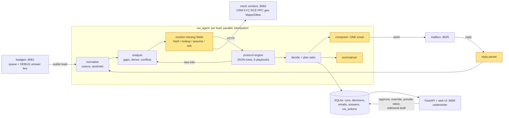

# Architecture and trade-offs

Yellow nodes have a model call (the interpreter inside *resolve*, composer, summarizer, reply parser). Everything else is plain code.

**Control flow per lead:** `normalize -> [analyze -> resolve -> evaluate protocols]* -> decide -> compose -> persist`. The bracketed loop repeats until nothing new is learned (a fetched value can unblock a derived one, which can unblock a protocol). Ground truth is never in this path: only the reply simulator, the CLI/server demo wiring and the evals may read it, and a test scans every other module for truth imports.

**Stack:** Python 3.11+, hand-rolled orchestration, SQLite, FastAPI plus a single static page, the plain Anthropic SDK, `uv`, pytest.

## Key trade-offs

| Choice | Alternative weighed | Why |
|---|---|---|
| **Deterministic engine walks the playbook; the LLM never decides an outcome** (D1, D6, D11) | LLM traverses the diagram | Underwriting rules must be auditable, testable and eval-able with exact answers. Trees are versioned JSON, one file per diagram, with every ambiguous reading logged in `JUDGEMENT_CALLS.md`. |
| **Hand-rolled pipeline** (D4) | LangGraph, Temporal | The flow is a short fixed pipeline, not an open-ended agent loop. A framework would add concepts to explain without adding capability. Temporal is the right answer for multi-day waits in production (hit list). |
| **Value resolution is a separate, reviewable map** (`field_resolution.json`, D6/D12) | tool choice inside each protocol, or by the model | Fetch / lookup / assume / derive / ask / defer are properties of a *field*, not of a decision node; an underwriter can review one file. **A demo simplification, not a production claim** (D25): real calls will need dynamically constructed queries and source selection. |
| **LLM only at four edges, with structured outputs, code validation and fallbacks** (D20) | one agent with tools | Smaller blast radius, cheap and deterministic tests (the whole loop runs without a key), and the failure mode of a bad model response is "use the template", not "wrong quote". |
| **One consolidated email via conditional asks** (D13) | ask round by round | The brief says one crisp message beats five. Cost: some questions turn out N/A (about 76% of conditional asks in the evals) and hard leads can produce long emails. A cap or priority order is an open product call. |
| **Playbook supersedes the registry's generic `requiredWhen`** (D14) | follow the registry | The diagrams are the playbook the brief says to encode; registry rules are used where the playbook is silent. |
| **SQLite + FastAPI + one HTML page** (D22) | a React app, Postgres | Cheapest thing a reviewer can run and read; the data model is the same one a real UI would use. |
| **Replies simulated from ground truth** | scripted canned replies | A producer's answer is a function of the actual property, so replies stay consistent with the answer key. Partial and no-reply modes exist for the imperfect cases. |

Design records: [`DECISIONS.md`](../DECISIONS.md) (D1 to D25, each with the reasoning), [`sim-harness/protocols/JUDGEMENT_CALLS.md`](../sim-harness/protocols/JUDGEMENT_CALLS.md) (every ambiguous reading in the diagrams and how it was resolved, for the underwriter to overrule), [`BACKLOG.md`](../BACKLOG.md).

Back to [README](../README.md). Product decisions: [PRODUCT_DECISIONS.md](PRODUCT_DECISIONS.md).
